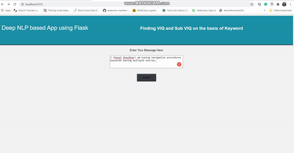

## Project Summary

For providing the highly condensed and useful information that allows users to get main idea is Keyphrase. In the recent decades the task to extract relevent information is taking attention since last 10 years. Different from previous studies, which are usually focused on automatically extracting keyphrases from documents or articles. Keyword based Search have many fundamental components including language understanding, retrieval and ranking, and language generation. Building powerful search engine requires processing natural language effectively and efficiently. Recent rapid growth of deep learning technologies has presented both opportunities and challenges in this area. This project is keyword based search technique based on Deep NLP. In this scope we have done some Deep NLP concept to parse Observation (query doing by users) and prepared List of keywords. Finally, we have list of list keywords of Observation data. In parsing, we have used Deep NLP concept for making keywords from Observation. There are many more algorithm is available for keyword extraction with Deep NLP. We have follow the following steps as below,

## Algorithmic Concepts

- Preprocessing the search keyword
- Preprocessing the Observation data
- Advance Natural Language Processing or Deep Parsing


#### Final output of Search Engine
<p align="center">
    
    <br>
    <sup>Testing the 3D Reconstruction Module of OpenPose</sup>
</p>

## Installation Guide

#### Installing Docker
* [https://blog.couchbase.com/setup-docker-windows-server-2016/](#docker installation guide)

## Technologies
Project is created with:
* Flask: 12.3
* NLTK: 2.33
* rake-nltk==1.0.4
* pandas==1.0.1
* numpy==1.17.4

## Setup
To run this project, use following steps

```
$ docker build -t "NAME:Dockerfile" .
example:
docker build -t flaskapp:latest .

&& then type following command,

$ docker run it flaskapp

```
#### Another way 
To run this project in another way you can follow the steps below,

```
Firstly, install python, pip and NLTK then,.

&& then type following command,

$ pip install -r requirements.txt

$ python app.py


```
## NLTK installation

* [NLTK installation on Window](https://www.nltk.org/install.html)

#### References
- ##### [Deep learning for specific information extraction from unstructured texts](https://towardsdatascience.com/deep-learning-for-specific-information-extraction-from-unstructured-texts-12c5b9dceada)
- ##### [Keyphrase Extraction Using Deep Recurrent Neural Networks on Twitter](https://www.aclweb.org/anthology/D16-1080.pdf)
- ##### [Keywords Extraction with Deep Neural Network Model](https://www.sciencedirect.com/science/article/abs/pii/S092523121931687X)